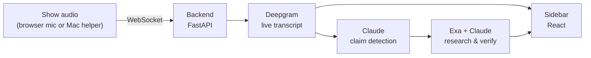

# Glass Sidebar

**A real-time fact-checking sidebar for podcasts and live conversations.**

Glass Sidebar listens to a show as it happens, transcribes it live, catches
factual claims as they're spoken, verifies them, and shows the correction right
next to the moment it was said — so a host (or a listener) sees what's true,
what's off, and what needs context, in real time.

> Built for the [This Week in Startups bounty](https://www.thisweekinstartups.com/bounty)
> — *"Create a fact-checker app for podcasts."*

---

## What it does

- **Listens in real time.** Captures the show's audio and streams a live
  transcript into a sidebar — no upload, no waiting for the episode to end.
- **Catches claims as they're spoken.** An LLM watches the running transcript
  for checkable factual claims — statistics, dates, attributions, historical
  facts — and ignores opinion and chatter.
- **Verifies them.** Each claim is researched against the web and returned as a
  card: **accurate**, **off**, or **needs context** — with the real number and
  a source.
- **Anchored to the transcript.** Every card points back to the exact line that
  triggered it, so you always know which sentence is being corrected.
- **Knows who said what.** An optional macOS helper splits the host's mic from
  the system audio, so claims made by remote guests are attributed correctly.
- **Anticipates.** Between claims, the backend researches the people and topics
  in play and predicts where the conversation is heading, so verification lands
  fast instead of lagging the conversation.

## How it works



1. Audio streams to the backend over a WebSocket — from the browser mic, or
   from the optional Mac helper (which also captures system audio).
2. **Deepgram** produces a live, speaker-labelled transcript.
3. **Claude** scans the transcript for factual claims worth checking.
4. Each claim is researched with **Exa** web search and judged by **Claude**,
   which returns a verdict, the corrected fact, and a source.
5. The transcript and the verdict cards stream back to the React sidebar over a
   second WebSocket.

Background workers run entity research and next-topic prediction so checks are
warm before a claim is even finished.

## Stack

| Part | Tech |
|------|------|
| Backend | Python 3.12 · FastAPI · Postgres · Redis · Arq workers |
| Frontend | Vite · React 19 · TypeScript · Tailwind |
| Mac helper | Swift menu-bar app (ScreenCaptureKit + AVAudioEngine) |
| Speech-to-text | Deepgram |
| Reasoning | Claude (Anthropic) |
| Web search | Exa |

## Run it locally

You need **Python 3.12**, **Node**, [uv](https://docs.astral.sh/uv/),
[pnpm](https://pnpm.io/), a **Postgres** database and **Redis** — plus API keys
for **Anthropic**, **Deepgram**, and **Exa**.

**Backend**

```bash
cd backend
cp .env.example .env     # set DATABASE_URL, REDIS_URL and the three API keys;
                         # set DEV_MODE=true to skip the auth-provider setup
uv sync
uv run alembic upgrade head
uv run uvicorn glass.api.main:app --port 8000          # API
uv run arq glass.workers.arq_settings.WorkerSettings   # worker — separate shell
```

**Frontend**

```bash
cd frontend
cp .env.example .env     # defaults work for a local backend
pnpm install
pnpm dev
```

Open the URL Vite prints, click **Start**, and play a podcast.

## The Mac helper (optional)

Browser-mic mode works with **zero install** — it's the default. The optional
macOS helper adds one thing: it captures *system* audio as a separate channel,
so when a remote guest speaks (over Zoom, Riverside, etc.) their claims are
attributed to them instead of to the host.

It's a tiny Swift menu-bar app. See [`mac-helper/README.md`](mac-helper/README.md)
to build it. (It isn't notarized, so macOS asks you to approve it on first
launch — the app walks you through that.)

## Project layout

```
backend/      FastAPI app, Arq workers, Deepgram/Claude/Exa integration
  glass/prompts/   the LLM prompts that drive claim detection & verification
frontend/     React sidebar dashboard
mac-helper/   optional Swift menu-bar audio helper (macOS)
```

## How this was built

Glass Sidebar was designed and built in about five days by one person working
with [Claude Code](https://claude.com/claude-code) — the backend, the React
sidebar, and the macOS helper, from the first commit to a live deployment.

## License

[MIT](LICENSE)
